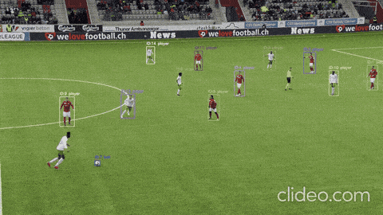

# ⚽ Rastreamento Multi-Objeto de Jogadores em Vídeos de Futebol

**[Português](#português) · [English](#english)**

---

## Português

> Trabalho de Conclusão de Curso — Engenharia Elétrica (Ifes, 2026). **Nota 98.**
> Detecção de jogadores com **YOLOv8** e comparação de **4 algoritmos de rastreamento multi-objeto** (MOT) sobre o dataset **SoccerNet 2022**, avaliando qual preserva melhor a identidade de cada jogador ao longo do vídeo.

<!-- COLOQUE O GIF AQUI (assets/tracking_demo.gif) -->

### O problema

Detectar jogadores frame a frame é a parte fácil. O difícil é **manter o mesmo ID para o mesmo jogador** quando eles se cruzam, se sobrepõem, saem e voltam ao quadro. Cada troca de identidade (*ID switch*) quebra qualquer análise que dependa de trajetória — distância percorrida, mapa de calor, velocidade, posse.

Este trabalho compara quatro estratégias de rastreamento multi-objeto sobre as mesmas detecções, medindo qual preserva melhor a identidade dos jogadores.

### Abordagem

1. **Dados:** dataset **SoccerNet 2022** (desafio de tracking).
2. **Detecção:** **YOLOv8** treinado para detectar jogadores, goleiros, árbitros e bola, com *data augmentation* (Albumentations).
3. **Rastreamento:** as mesmas detecções são passadas por 4 algoritmos — **ByteTrack**, **StrongSORT**, **OC-SORT** e **DeepSORT** (via BoxMOT).
4. **Avaliação:** metodologia em 3 fases, com separação de validação para evitar vazamento de dados (*data leakage*):
   - **Fase 1** — otimização do limiar de confiança da detecção;
   - **Fase 2** — sintonia fina dos hiperparâmetros de cada tracker;
   - **Fase 3** — teste cego em sequências inéditas (ambiente real).

### Resultados — Fase 3 (teste cego)

| Algoritmo   | MOTA (%) ↑ | FP ↓   | FN ↓    | ID Switches ↓ |
|-------------|-----------|--------|---------|---------------|
| **StrongSORT** | **77,1** | 34.211 | 86.965  | 8.196 |
| ByteTrack   | 76,8      | 23.525 | 99.685  | 7.811 |
| OC-SORT     | 76,7      | 26.598 | 96.304  | 8.702 |
| DeepSORT    | 65,3      | 85.867 | 106.051 | 4.209 |

**Conclusão:** StrongSORT obteve a maior acurácia (MOTA 77,1%), com ByteTrack e OC-SORT praticamente empatados logo atrás. O DeepSORT ficou bem abaixo em MOTA — apesar de ter o menor número de trocas de identidade, acumula muito mais falsos positivos e negativos. A disputa real foi entre StrongSORT, ByteTrack e OC-SORT.

### Stack

- Python
- Ultralytics **YOLOv8** (detecção)
- **BoxMOT** — ByteTrack, StrongSORT, OC-SORT
- **DeepSORT** (deep-sort-realtime)
- **MotMetrics** (métrica MOTA)
- OpenCV, NumPy, Pandas

### Como rodar

O notebook (`TCC_Rastreamento_Jogadores.ipynb`) foi desenvolvido no Google Colab e segue a ordem: configuração do ambiente → preparação dos dados → treino do detector → rastreamento (Fases 1 a 3) → avaliação.

> O dataset SoccerNet e os pesos do modelo treinado (`best.pt`) não estão versionados por serem arquivos grandes. O SoccerNet pode ser baixado pelo pacote oficial (célula 1.2 do notebook).

### Sobre

TCC em Engenharia Elétrica (Ifes), defendido em 2026 com nota **98**.
Autor: **Fernando** — interesse em visão computacional e ciência de dados aplicadas ao esporte.

---

## English

> Undergraduate thesis — Electrical Engineering (Ifes, Brazil, 2026). **Graded 98/100.**
> Player detection with **YOLOv8** and a comparison of **4 multi-object tracking (MOT) algorithms** on the **SoccerNet 2022** dataset, measuring which one best preserves each player's identity throughout the video.

### The problem

Detecting players frame by frame is the easy part. The hard part is **keeping the same ID on the same player** as they cross, overlap, and leave and re-enter the frame. Every *ID switch* breaks any analysis that relies on trajectory — distance covered, heatmaps, speed, possession.

This project compares four multi-object tracking strategies over the same detections, measuring which one best preserves player identity.

### Approach

1. **Data:** **SoccerNet 2022** dataset (tracking challenge).
2. **Detection:** **YOLOv8** trained to detect players, goalkeepers, referees and the ball, with data augmentation (Albumentations).
3. **Tracking:** the same detections are run through 4 algorithms — **ByteTrack**, **StrongSORT**, **OC-SORT** and **DeepSORT** (via BoxMOT).
4. **Evaluation:** a 3-phase methodology with a held-out validation split to avoid data leakage:
   - **Phase 1** — detection confidence threshold optimization;
   - **Phase 2** — per-tracker hyperparameter tuning;
   - **Phase 3** — blind test on unseen sequences (real-world setting).

### Results — Phase 3 (blind test)

| Algorithm   | MOTA (%) ↑ | FP ↓   | FN ↓    | ID Switches ↓ |
|-------------|-----------|--------|---------|---------------|
| **StrongSORT** | **77.1** | 34,211 | 86,965  | 8,196 |
| ByteTrack   | 76.8      | 23,525 | 99,685  | 7,811 |
| OC-SORT     | 76.7      | 26,598 | 96,304  | 8,702 |
| DeepSORT    | 65.3      | 85,867 | 106,051 | 4,209 |

**Conclusion:** StrongSORT achieved the highest accuracy (MOTA 77.1%), with ByteTrack and OC-SORT nearly tied just behind. DeepSORT trailed in MOTA — despite the fewest ID switches, it accumulates far more false positives and negatives. The real race was between StrongSORT, ByteTrack and OC-SORT.

### Stack

- Python
- Ultralytics **YOLOv8** (detection)
- **BoxMOT** — ByteTrack, StrongSORT, OC-SORT
- **DeepSORT** (deep-sort-realtime)
- **MotMetrics** (MOTA)
- OpenCV, NumPy, Pandas

### How to run

The notebook (`TCC_Rastreamento_Jogadores.ipynb`) was built in Google Colab and follows the order: environment setup → data preparation → detector training → tracking (Phases 1–3) → evaluation.

> The SoccerNet dataset and the trained model weights (`best.pt`) are not versioned due to file size. SoccerNet can be downloaded via its official package (cell 1.2 of the notebook).

### About

Undergraduate thesis in Electrical Engineering (Ifes, Brazil), defended in 2026, graded **98/100**.
Author: **Fernando** — interested in computer vision and data science applied to sports.
